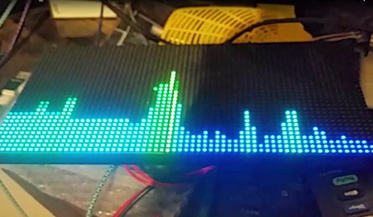

# Spectrum Analyzer Sketch
Blinky Lights to music.

You will have to add additional bias filtering to the input of the esp32. The example is illustrated at the first part of the sketch. One filter per channel. 
the waterfall mode is stretching the math capacity of the esp32 about as much as I can make it go. Im sure there is room for improvement. Enjoy and hope its useful. 
